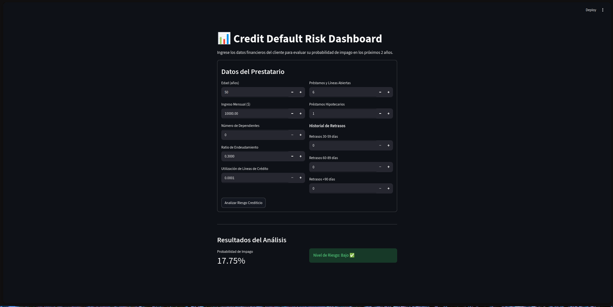
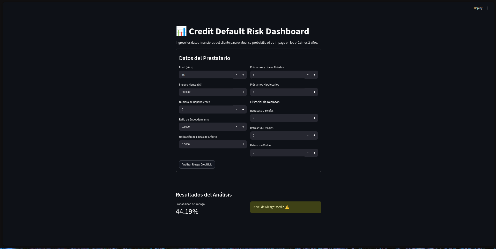
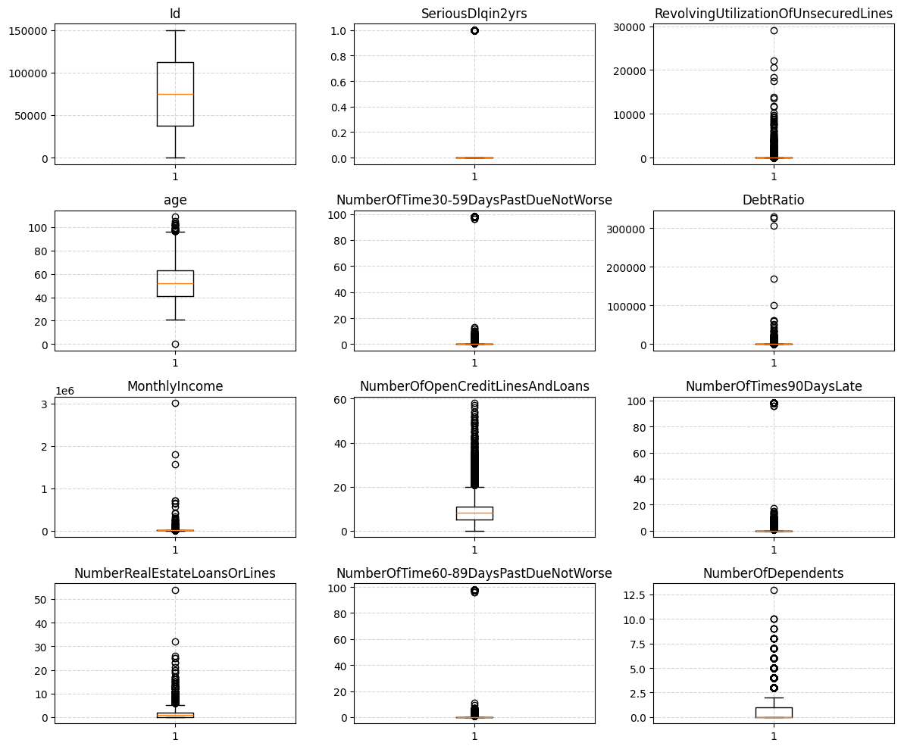
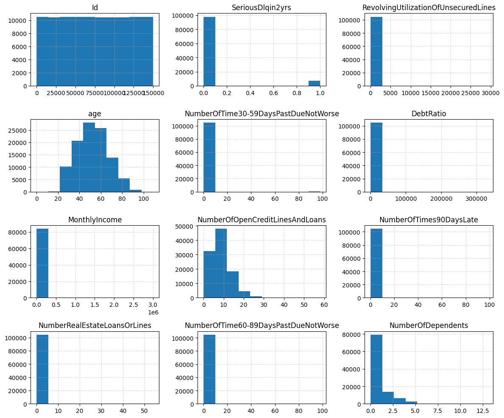
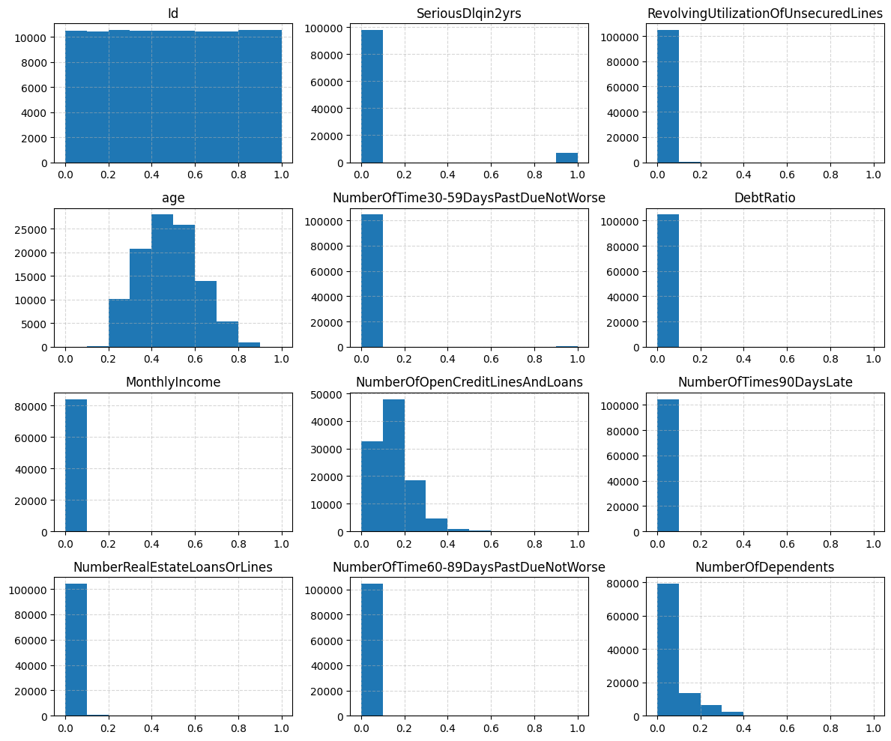
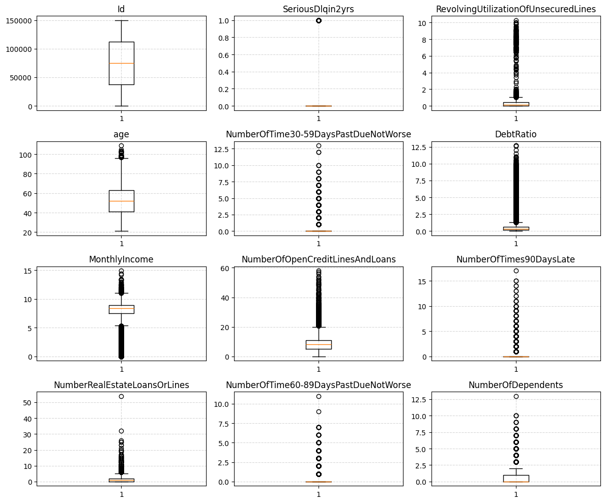
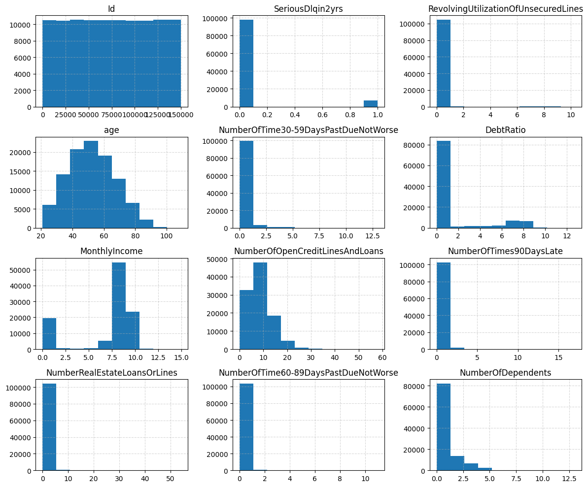
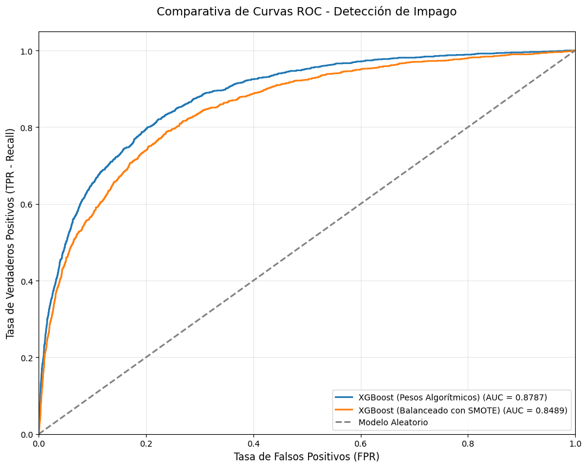

<div align="center">

# 🏦 Give Me Some Credit

### Predicción de Incumplimiento Crediticio — Pipeline End-to-End de Machine Learning

> **¿Puede un modelo predecir si un prestatario caerá en mora grave en los próximos 2 años?**
> Este proyecto responde esa pregunta con un pipeline completo: desde el análisis exploratorio hasta una API REST dockerizada con interfaz interactiva.

[](https://www.python.org/)
[](https://xgboost.readthedocs.io/)
[](https://fastapi.tiangolo.com/)
[](https://streamlit.io/)
[](https://docs.docker.com/compose/)
[](LICENSE)

---

<p>
  <a href="#-quick-start">Quick Start</a> •
  <a href="#-arquitectura-del-sistema">Arquitectura</a> •
  <a href="#-resultados-del-modelado">Resultados</a> •
  <a href="#-api-rest">API REST</a> •
  <a href="#-demo--frontend-streamlit">Demo</a> •
  <a href="#-docker">Docker</a>
</p>

</div>

---

## 📌 Descripción del Proyecto

Este proyecto aborda uno de los problemas más críticos de la industria financiera: la **predicción de incumplimiento crediticio** (*credit default prediction*). Utilizando el dataset de la competencia [Give Me Some Credit](https://www.kaggle.com/competitions/give-me-some-credit) de Kaggle (~150,000 prestatarios, con una tasa de default del ~6.7%), se construyó un sistema de *credit scoring* de extremo a extremo que incluye:

- 🔍 **Análisis exploratorio** profundo con detección de outliers y valores nulos
- 🧹 **Limpieza de datos** con imputación multivariada (MICE) y transformaciones logarítmicas
- 🧠 **Modelado predictivo** con XGBoost y dos estrategias de balanceo de clases
- ⚡ **Optimización bayesiana** de hiperparámetros con Optuna (5-fold CV)
- 🔮 **Explicabilidad** del modelo con SHAP para transparencia en decisiones crediticias
- 🐳 **Deployment** full-stack dockerizado (FastAPI + Streamlit)

### 🎯 Impacto en el Negocio

| Beneficio | Descripción |
|-----------|-------------|
| 💰 **Reducción de pérdidas** | Identificar prestatarios de alto riesgo antes de aprobar créditos |
| ⚙️ **Automatización** | Reemplazar procesos manuales de evaluación crediticia |
| 📋 **Cumplimiento regulatorio** | SHAP proporciona explicaciones individuales para cada decisión |
| 📊 **Optimización de cartera** | Mejor asignación de tasas de interés según nivel de riesgo |

---

## 🏗️ Arquitectura del Sistema

```
┌─────────────────────────────────────────────────────────────────────────┐
│                         Docker Compose Network                         │
│                                                                        │
│  ┌──────────────────────┐         ┌──────────────────────────────────┐ │
│  │   🖥️  Frontend        │  HTTP   │   ⚡ Backend                     │ │
│  │   Streamlit (:8501)  │────────▶│   FastAPI (:8000)               │ │
│  │                      │         │                                  │ │
│  │  • Formulario de     │         │  ┌────────────────────────────┐ │ │
│  │    datos del cliente  │         │  │  /predict (POST)          │ │ │
│  │  • Visualización de  │◀────────│  │  /health  (GET)           │ │ │
│  │    probabilidad y    │  JSON   │  │  /docs    (Swagger)       │ │ │
│  │    nivel de riesgo   │         │  └──────────┬─────────────────┘ │ │
│  └──────────────────────┘         │             │                    │ │
│                                    │  ┌──────────▼─────────────────┐ │ │
│                                    │  │  🧠 ML Service             │ │ │
│                                    │  │  • preprocessor.pkl        │ │ │
│                                    │  │    (MICE Imputer + params) │ │ │
│                                    │  │  • xgboost_final.json      │ │ │
│                                    │  │    (Modelo entrenado)      │ │ │
│                                    │  └────────────────────────────┘ │ │
│                                    └──────────────────────────────────┘ │
└─────────────────────────────────────────────────────────────────────────┘
```

**Flujo de inferencia:**
1. El usuario ingresa datos financieros en **Streamlit**
2. Streamlit envía un `POST` a **FastAPI** (`/predict`)
3. FastAPI valida el payload con **Pydantic** y lo pasa al servicio ML
4. El servicio ML aplica las **mismas transformaciones** del entrenamiento (log1p, MICE, feature engineering)
5. **XGBoost** genera la probabilidad de default
6. La API clasifica el riesgo (Bajo / Medio / Alto) y devuelve la respuesta

---

## 🗂️ Estructura del Proyecto

```
Give-Me-Some-Credit/
├── api/                                    # 🔌 Backend REST API
│   ├── Dockerfile                          #    Dockerfile del backend
│   ├── main.py                             #    FastAPI app (endpoints)
│   ├── ml_service.py                       #    Lógica de inferencia + preprocesamiento
│   ├── schemas.py                          #    Modelos Pydantic (request/response)
│   └── requirements.txt                    #    Dependencias del backend (Docker)
├── frontend/                               # 🖥️ Frontend Interactivo
│   ├── Dockerfile                          #    Dockerfile del frontend
│   ├── app.py                              #    Streamlit app
│   └── requirements.txt                    #    Dependencias del frontend (Docker)
├── data/                                   # 📂 Datasets procesados
├── images/                                 # 🖼️ Visualizaciones del EDA y resultados
├── models/                                 # 🧠 Artefactos de ML entrenados
│   ├── preprocessor.pkl                    #    MICE Imputer + mediana edad + config
│   ├── xgboost_base_optimizado.json        #    XGBoost con pesos algorítmicos
│   ├── xgboost_smote_optimizado.json       #    XGBoost con SMOTE
│   ├── xgboost_final.json                  #    Modelo final seleccionado
│   └── xgboost_final.pkl                   #    Modelo final (formato pickle)
├── backend.Dockerfile                      # 🐳 Dockerfile de producción (backend)
├── frontend.Dockerfile                     # 🐳 Dockerfile de producción (frontend)
├── docker-compose.yml                      # 🐳 Orquestación full-stack
├── Give_me_some_credit.ipynb               # 📓 Notebook exploratorio (EDA + SHAP)
├── preprocess.py                           # 🧹 Pipeline de limpieza y transformación
├── train.py                                # 🏋️ Entrenamiento + Optuna + evaluación
├── my_xgboost_submission.csv               # 📤 Submission para Kaggle
├── pyproject.toml                          # 📦 Configuración del proyecto (uv)
├── uv.lock                                 # 🔒 Lock de dependencias (reproducibilidad)
└── LICENSE                                 # ⚖️ Licencia MIT
```

---

## ⚡ Quick Start

### Opción 1: Docker Compose (Recomendado — Producción)

La forma más rápida de levantar todo el sistema. No necesitas instalar Python ni dependencias.

```bash
# 1. Clonar el repositorio
git clone https://github.com/DiegoRomanP/Give-Me-Some-Credit.git
cd Give-Me-Some-Credit

# 2. Levantar toda la arquitectura con un solo comando
docker-compose up --build
```

| Servicio | URL | Descripción |
|----------|-----|-------------|
| 🖥️ **Frontend** | [`http://localhost:8501`](http://localhost:8501) | Dashboard interactivo de Streamlit |
| ⚡ **Backend** | [`http://localhost:8000`](http://localhost:8000) | API REST de FastAPI |
| 📖 **API Docs** | [`http://localhost:8000/docs`](http://localhost:8000/docs) | Documentación Swagger interactiva |

### Opción 2: Desarrollo Local con `uv`

Este proyecto utiliza [**uv**](https://docs.astral.sh/uv/) como gestor de paquetes. El archivo `uv.lock` garantiza **reproducibilidad exacta** de dependencias.

```bash
# 1. Instalar uv (si no lo tienes)
curl -LsSf https://astral.sh/uv/install.sh | sh    # Linux/macOS
powershell -ExecutionPolicy ByPass -c "irm https://astral.sh/uv/install.ps1 | iex"  # Windows

# 2. Clonar e instalar
git clone https://github.com/DiegoRomanP/Give-Me-Some-Credit.git
cd Give-Me-Some-Credit
uv sync

# 3. Descargar datos de Kaggle
uv run python -c "import kagglehub; kagglehub.competition_download('give-me-some-credit')"

# 4. Ejecutar el pipeline completo
uv run python preprocess.py   # Limpieza + imputación MICE + exportar artefactos
uv run python train.py        # Entrenamiento + Optuna + modelo final

# 5. Levantar la API localmente
uv run uvicorn api.main:app --reload --port 8000

# 6. (En otra terminal) Levantar Streamlit
uv run streamlit run frontend/app.py
```

---

## 🔌 API REST

### Endpoints

| Método | Endpoint | Descripción | Auth |
|--------|----------|-------------|------|
| `GET` | `/health` | Health check del servicio | No |
| `POST` | `/predict` | Predicción de riesgo crediticio | No |
| `GET` | `/docs` | Documentación Swagger (auto-generada) | No |

### `POST /predict` — Request Body

```json
{
  "RevolvingUtilizationOfUnsecuredLines": 0.5,
  "age": 45,
  "NumberOfTime30-59DaysPastDueNotWorse": 0,
  "DebtRatio": 0.3,
  "MonthlyIncome": 8000.0,
  "NumberOfOpenCreditLinesAndLoans": 8,
  "NumberOfTimes90DaysLate": 0,
  "NumberRealEstateLoansOrLines": 1,
  "NumberOfTime60-89DaysPastDueNotWorse": 0,
  "NumberOfDependents": 2
}
```

> **Nota:** `MonthlyIncome` y `NumberOfDependents` son **opcionales** — el modelo usa imputación MICE entrenada para inferir valores faltantes.

### Response

```json
{
  "default_probability": 0.0423,
  "risk_level": "Bajo"
}
```

| Campo | Tipo | Descripción |
|-------|------|-------------|
| `default_probability` | `float` | Probabilidad de impago (0.0 – 1.0) |
| `risk_level` | `string` | Clasificación: **Bajo** (<0.3), **Medio** (0.3–0.7), **Alto** (>0.7) |

### Ejemplo con `curl`

```bash
curl -X POST http://localhost:8000/predict \
  -H "Content-Type: application/json" \
  -d '{
    "RevolvingUtilizationOfUnsecuredLines": 0.02,
    "age": 55,
    "NumberOfTime30-59DaysPastDueNotWorse": 0,
    "DebtRatio": 0.15,
    "MonthlyIncome": 12000,
    "NumberOfOpenCreditLinesAndLoans": 10,
    "NumberOfTimes90DaysLate": 0,
    "NumberRealEstateLoansOrLines": 2,
    "NumberOfTime60-89DaysPastDueNotWorse": 0,
    "NumberOfDependents": 1
  }'
```

---

## 🖥️ Demo — Frontend Streamlit

La interfaz permite ingresar los datos financieros de un cliente y obtener una predicción instantánea de riesgo crediticio.

<p align="center">
  
</p>

<p align="center"><em>▲ Resultado de predicción: Riesgo <strong>Bajo</strong> — Cliente con perfil financiero saludable</em></p>

<p align="center">
  
</p>

<p align="center"><em>▲ Resultado de predicción: Riesgo <strong>Medio</strong> — Cliente con indicadores de alerta</em></p>

---

## 🔍 Análisis Exploratorio de Datos (EDA)

### Distribución de Variables — Datos Brutos

Los boxplots revelan la presencia de **outliers extremos** en el dataset original:

<p align="center">
  
</p>

<p align="center"><em>▲ Boxplots del dataset original — Se detectan valores imposibles (edad = 0, retrasos > 90 en ventana de 24 meses) y distribuciones con colas extremadamente largas en variables financieras</em></p>

<p align="center">
  
</p>

<p align="center"><em>▲ Histogramas originales — Sesgo extremo en <code>RevolvingUtilizationOfUnsecuredLines</code>, <code>DebtRatio</code> y <code>MonthlyIncome</code>, lo que justifica la aplicación de transformaciones logarítmicas</em></p>

### Distribuciones Después de Normalización

Tras aplicar `np.log1p()` a las variables sesgadas:

<p align="center">
  
</p>

<p align="center"><em>▲ Histogramas post-normalización — La transformación <code>log1p</code> logra distribuciones más simétricas, facilitando el proceso de imputación (MICE) y mejorando la estabilidad del modelo</em></p>

### Datos Después de la Limpieza Completa

Boxplots y distribuciones tras el preprocesamiento completo (capping de códigos de error, imputación MICE, transformaciones):

<p align="center">
  
</p>

<p align="center"><em>▲ Boxplots post-limpieza — Los outliers extremos fueron controlados. Las distribuciones mantienen variabilidad real sin valores imposibles</em></p>

<p align="center">
  
</p>

<p align="center"><em>▲ Histogramas post-limpieza — Distribuciones finales listas para entrenamiento, con valores faltantes completamente imputados por MICE</em></p>

---

## 📈 Resultados del Modelado

Se compararon **dos estrategias** para manejar el desbalanceo de clases (~6.7% default rate):

### Estrategia 1: XGBoost con Pesos Algorítmicos

Utiliza `scale_pos_weight` para penalizar los errores en la clase minoritaria (impago). El peso se calcula dinámicamente por pliegue durante la validación cruzada.

| Clase | Precision | Recall | F1-Score | Support |
|-------|-----------|--------|----------|---------|
| Buen Pagador (0) | 0.98 | 0.81 | 0.88 | 19,571 |
| Impago (1) | 0.22 | **0.77** | 0.34 | 1,390 |
| **Accuracy** | | | **0.80** | 20,961 |

- **ROC-AUC Local (holdout 20%):** `0.8664`
- **ROC-AUC optimizado con Optuna (5-fold CV):** `0.8643`

### Estrategia 2: XGBoost con SMOTE

Genera muestras sintéticas de la clase minoritaria antes del entrenamiento con `imbalanced-learn`.

| Clase | Precision | Recall | F1-Score | Support |
|-------|-----------|--------|----------|---------|
| Buen Pagador (0) | 0.96 | 0.96 | 0.96 | 19,571 |
| Impago (1) | 0.42 | 0.37 | 0.39 | 1,390 |
| **Accuracy** | | | **0.92** | 20,961 |

- **ROC-AUC Local (holdout 20%):** `0.8444`
- **ROC-AUC optimizado con Optuna (5-fold CV):** `0.8501`

### Comparativa Visual — Curva ROC

<p align="center">
  
</p>

<p align="center"><em>▲ La curva ROC demuestra que el modelo con <strong>pesos algorítmicos</strong> domina al modelo con SMOTE en todos los umbrales de clasificación</em></p>

### 🏆 Tabla Comparativa Final

| Métrica | XGBoost (Pesos Algorítmicos) | XGBoost (SMOTE) |
|---------|:----------------------------:|:---------------:|
| **ROC-AUC (CV)** | **0.8643** ✅ | 0.8501 |
| **Recall (Impago)** | **0.77** ✅ | 0.37 |
| **Precision (Impago)** | 0.22 | **0.42** ✅ |
| **Accuracy** | 0.80 | **0.92** ✅ |

> **📌 Decisión:** En *credit scoring*, el **Recall** de la clase de impago es la métrica más importante — el costo de no detectar un impago (falso negativo) supera significativamente al de rechazar un buen pagador (falso positivo). Por esta razón, el modelo con **pesos algorítmicos** fue seleccionado como modelo final.

---

## 🧠 Conclusiones Técnicas

### Impacto del SMOTE en el Desbalance

SMOTE mejoró la precisión general (accuracy: 0.92) pero a un costo crítico: **el Recall de la clase de impago cayó a 0.37** (vs. 0.77 con pesos algorítmicos). Las muestras sintéticas generadas en la frontera de decisión introdujeron ruido que dificultó la detección de los casos de impago reales. En datasets financieros con distribuciones complejas y colas pesadas, los métodos de sobremuestreo paramétricos como SMOTE tienden a generar instancias que no representan fielmente los patrones de riesgo subyacentes.

### Efecto de la Limpieza de Outliers

El tratamiento de outliers fue clave para la estabilidad del modelo:
- **Edad = 0:** Reemplazada por la mediana del train (~52 años) para evitar filtraciones entre train/test
- **Retrasos > 90:** Valores de 96 y 98 son códigos de error del sistema, no retrasos reales. Se convirtieron a `NaN` para que MICE los imputara correctamente
- **Variables financieras:** `log1p()` comprimió las colas extremas de `DebtRatio` y `RevolvingUtilizationOfUnsecuredLines`, mejorando la convergencia de la imputación MICE

### ¿Por qué XGBoost?

| Factor | Justificación |
|--------|--------------|
| **Desbalance nativo** | `scale_pos_weight` maneja el ratio 14:1 sin necesidad de re-muestreo |
| **Datos tabulares** | XGBoost sigue siendo state-of-the-art en competencias de datos tabulares |
| **Valores faltantes** | Aunque usamos MICE, XGBoost maneja nulos nativamente como respaldo |
| **Interpretabilidad** | Importancia de features integrada + compatibilidad completa con SHAP |
| **Velocidad** | Entrenamiento y predicción extremadamente rápidos para un dataset de 150K filas |

### Decisiones de Diseño de la API

- **Pydantic con alias:** Los nombres de las features del dataset original contienen guiones (ej. `NumberOfTime30-59DaysPastDueNotWorse`), que no son identificadores válidos en Python. Se usaron `Field(alias=...)` para aceptar los nombres originales en el JSON
- **Campos opcionales con MICE:** `MonthlyIncome` y `NumberOfDependents` son opcionales en el request — el `preprocessor.pkl` contiene un `IterativeImputer` ajustado que infiere los valores faltantes con las mismas distribuciones del entrenamiento
- **Artefacto inmutable:** El `preprocessor.pkl` empaqueta el imputer, la mediana de edad de referencia y la lista de columnas en un solo archivo, garantizando consistencia entre desarrollo y producción
- **Imputación por pliegue en CV:** Durante la optimización con Optuna, la imputación se ajusta **por pliegue** usando datos pre-imputación (`train_pre_impute.csv`), evitando filtración de estadísticas del fold de validación

---

## 🐳 Docker

### Arquitectura de Contenedores

```yaml
services:
  backend:   # FastAPI + XGBoost + preprocessor.pkl
    ports: ["8000:8000"]
    volumes: ["./models:/app/models"]    # Hot-swap de modelos sin rebuild

  frontend:  # Streamlit Dashboard
    ports: ["8501:8501"]
    environment:
      BACKEND_URL: http://backend:8000/predict    # DNS interno de Docker
    depends_on: [backend]
```

### Comandos Útiles

```bash
# Levantar todo
docker-compose up --build

# Levantar solo el backend
docker-compose up --build backend

# Ver logs en tiempo real
docker-compose logs -f

# Detener todo
docker-compose down

# Rebuild sin caché (después de cambios en requirements.txt)
docker-compose build --no-cache
```

> **Tip:** Los modelos se montan como volumen (`./models:/app/models`). Puedes reentrenar y reemplazar `xgboost_final.json` sin necesidad de hacer rebuild del contenedor.

---

## 📦 Dependencias Principales

| Paquete | Versión | Uso |
|---------|---------|-----|
| `xgboost` | ≥3.2.0 | Modelo de clasificación principal |
| `scikit-learn` | ≥1.8.0 | MICE (IterativeImputer), métricas, train/test split |
| `imbalanced-learn` | ≥0.14.1 | Sobremuestreo con SMOTE |
| `optuna` | ≥4.8.0 | Optimización bayesiana de hiperparámetros |
| `fastapi` | ≥0.136.3 | Framework de API REST asíncrono |
| `pydantic` | ≥2.13.4 | Validación de datos de entrada con alias |
| `uvicorn` | ≥0.49.0 | Servidor ASGI para FastAPI |
| `pandas` | ≥3.0.2 | Manipulación de DataFrames |
| `numpy` | ≥2.4.4 | Operaciones numéricas y transformaciones |
| `matplotlib` | ≥3.10.9 | Visualización de gráficos |
| `seaborn` | ≥0.13.2 | Visualización estadística |
| `shap` | ≥0.51.0 | Explicabilidad del modelo |
| `streamlit` | ≥1.24.0 | Frontend interactivo |
| `joblib` | ≥1.5.3 | Serialización de artefactos (preprocessor.pkl) |

---

## 🗺️ Roadmap — Futuras Mejoras

- [ ] 🔄 **Monitoreo de Data Drift** — Implementar detección automática de desviaciones en las distribuciones de entrada con [Evidently AI](https://www.evidentlyai.com/) o [NannyML](https://nannyml.com/)
- [ ] 📊 **Dashboard de métricas en producción** — Panel Grafana/Prometheus para visualizar volumen de requests, latencia, y distribución de scores en tiempo real
- [ ] 🔐 **Autenticación y rate limiting** — API keys + throttling para entornos multi-tenant
- [ ] 🧪 **Tests automatizados** — Suite de pytest para el pipeline de preprocesamiento y los endpoints de la API con datos sintéticos
- [ ] ☁️ **CI/CD + Cloud Deployment** — GitHub Actions para build, test y deploy automático en AWS/GCP

---

## 📄 Licencia

Este proyecto está bajo la Licencia MIT — consulta el archivo [LICENSE](LICENSE) para más detalles.

---

## 👤 Autor

**Diego Roman** — [@DiegoRomanP](https://github.com/DiegoRomanP)

---

<div align="center">

*Proyecto desarrollado con enfoque de Data Analytics, priorizando reproducibilidad, interpretabilidad y rigor estadístico.*

Hecho con ❤️ por [Diego Román](https://github.com/DiegoRomanP)

</div>
